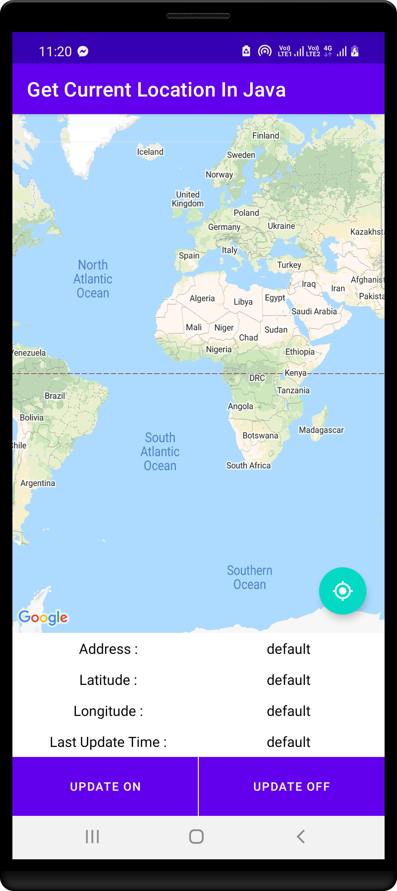
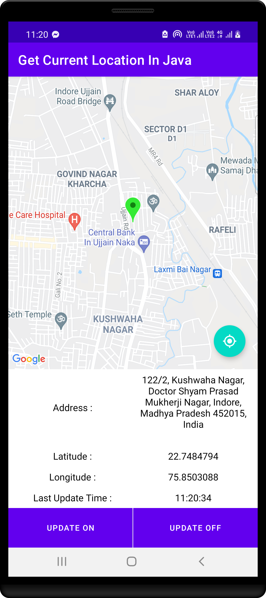
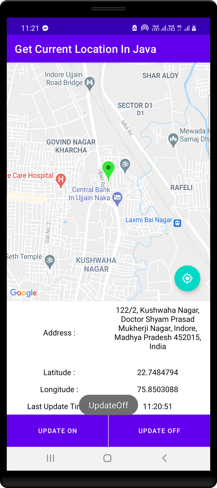

# JAVA - Get Current Location

This code helps you to get current location of device

Let GetCurrentLocationInJava support

- Get current location
- On update of location
- Off update of location
- Same work when orientation change

name, firstName, lastName, photoUrl

|    First 1   |     First 2     |
|--------------|-----------------|
|  |  |

|    First 3   |     First 4     |
|--------------|-----------------|
|  |  |

## Author ##

Rohit Yadav

[rohitnotes24@gmail.com](mailto:rohitnotes24@gmail.com)

[http://badasoftware.com/](http://badasoftware.com/)
